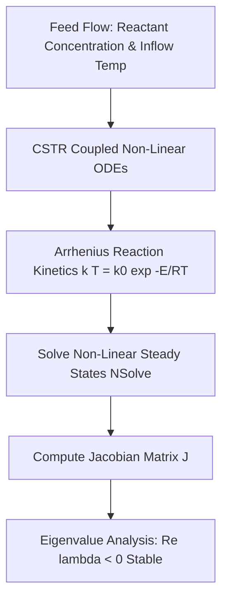

# 38 - Non-Linear Chemical Dynamics & CSTR Reactor Stability (Wolfram)

## Executive Overview
A scientific computing and non-linear dynamic stability analysis engine written in the **Wolfram Language**. It models non-isothermal **Continuous Stirred-Tank Reactors (CSTR)** governed by non-linear Arrhenius kinetics, numerically computes multiple steady-state operating points, and analyzes Jacobian eigenvalue stability to prevent thermal runaway.

## System Dynamics Architecture



### Source Tree
- **`src/reactor_dynamics.wl`**: Wolfram Language package defining mass and energy balance differential equations.
- **`src/run_analysis.wls`**: Executable Wolfram script.
- **`runner/run.js`**: Numerical Jacobian stability simulation validating eigenvalue calculations.

## Mathematical Formulation: CSTR Non-Linear Dynamics
Coupled mass and energy balance ODEs:
$$\frac{d C_A}{dt} = \frac{F}{V}(C_{A0} - C_A) - k_0 e^{-\frac{E}{RT}} C_A$$
$$\frac{dT}{dt} = \frac{F}{V}(T_0 - T) + \frac{(-\Delta H)}{\rho C_p} k_0 e^{-\frac{E}{RT}} C_A - \frac{U A}{V \rho C_p}(T - T_c)$$

Jacobian stability condition: An operating point is asymptotically stable if and only if all eigenvalues of the Jacobian matrix satisfy $\text{Re}(\lambda_i) < 0$.

## Native Wolfram Script Execution
```bash
wolframscript -file src/run_analysis.wls
```

## Universal Verification
```bash
node runner/run.js
node orchestrator/run.js --project=38-wolfram
```

## Senior Interview Q&A
- **Q: Why can CSTR reactors exhibit hysteresis and multiple steady states?** Due to the non-linear coupling between exponential heat generation (Arrhenius rate) and linear heat removal. In an exothermic reaction, a small increase in temperature exponentially accelerates heat release, leading to thermal runaway or bistability.
- **Q: Why Wolfram Language?** It seamlessly blends exact symbolic calculus (computing analytical Jacobians in closed form) with high-precision arbitrary-precision numerical solvers (`NSolve`, `NDSolve`).\n